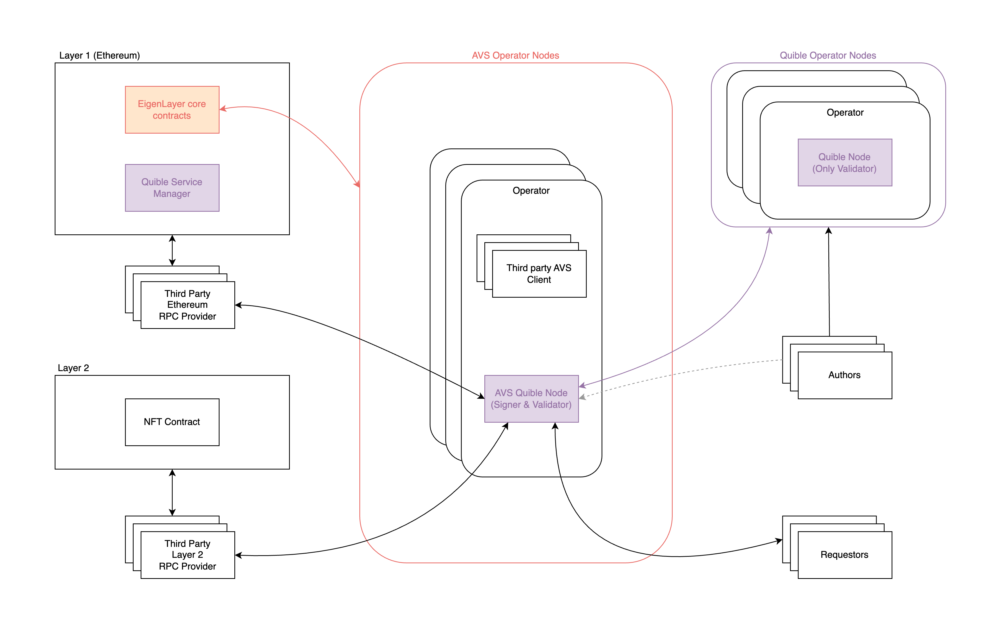

# Quible Node

_Flagship reference implementation of the Quible Protocol, for use in the [Quible Network](https://quible.network)._

### What is Quible?

Quible is a blockchain-powered decentralized certificate authority, designed to fulfill practical needs for authentication in a variety of use cases. Traditional certificate authorities are underutilized today because they are often overlooked and considered to be only appropriate for certifying domain names in the context of TLS/SSL connections. Quible aims to bridge the gap between signature-based authentication standards such as JSON Web Tokens and the lesser-known world of certificate authorities. Quible operates differently from traditional CAs in several ways. First, Quible stores identities and identity claims within a blockchain, replacing the need for applications and developers to build their own certificate management solution. Second, Quible handles certificate signing requests on-demand, allowing for easy integrations and short certificate lifespans. Similar to JSON Web Tokens, Quible certificates are much simpler and easy to work with than traditional X.509 certificates.

## Installation

_Installation instructions coming soon!_

## Acknowledgements

Big thanks to:

- [The Quible Team](https://quible.network) for building this implementation
- [dWallet Labs](https://pera.io) for inspiring the project with the innovation of [2PC-MPC ECDSA](https://github.com/dwallet-labs/2pc-mpc).
- [Paradigm](https://www.paradigm.xyz/) for building [reth](https://github.com/paradigmxyz/reth), providing a good reference for building state-of-the-art Proof-of-Stake in Rust.
